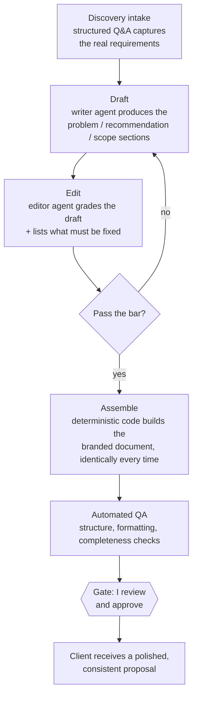

# Case Study: From Discovery Call to Signed Proposal

> Writing a good proposal by hand takes hours and comes out a little different every time. I built an engine that turns the answers from a discovery conversation into a polished, branded, consistent proposal, with a writer, an editor, automated quality checks, and a human gate before anything reaches a client.

**Author:** Paul Arceneaux, founder of [Snap2Flow](https://snap2flow.com)
**What this is:** A narrative walkthrough of a production document-generation system. No source code is published here.

---

## The problem

The proposal is where a lot of deals quietly die. Not because the work isn't there, but because the document took too long to produce, went out three days later than it should have, or came back inconsistent: the pricing formatted one way last time and another way this time, a section missing, the timeline vague.

Hand-writing every proposal from scratch is slow and uneven. The opposite extreme, a rigid fill-in-the-blank template, is fast but generic, and prospects can smell a mail-merge. And the version some people reach for now, "let the AI write the whole proposal," produces something that *looks* finished and contains a subtle error in exactly the place you can least afford one: the scope or the price.

I wanted proposals that were fast *and* consistent *and* genuinely tailored, without ever risking an unfinished or wrong document landing in a client's inbox.

## The approach

I treated the proposal as an assembly line with a quality gate, not a single act of writing. The conversation produces structured inputs; specialist agents draft and review the parts that need real writing; deterministic code assembles the final branded document the same way every time; and I approve before it's ever sent.

**Intake.** A structured discovery conversation captures the inputs that actually matter: the client's real problem, what they need, the shape of the engagement. Good inputs are most of the battle.

**Draft.** A writer agent produces the sections that require genuine writing: the problem statement, the recommendation, the scope. This is judgment work, so a specialist does it.

**Edit.** An editor agent reviews that draft against my house style and quality rules, grades it, and lists what has to change. If it's not good enough, it goes back. Two sets of eyes, both specialized.

**Assemble.** Once the content passes, deterministic code builds the final branded document, pulling the approved sections into a consistent, correctly formatted layout the *same way every time.* No drifting formatting, no "creative" layout, no missing section.

**Automated QA.** The assembled document is checked for structure, formatting, and completeness before a human ever looks at it.

**Gate.** The proposal stops here. It is **never** exported or sent to a client until I review it and explicitly say "go."

## How it works in practice

The split is the whole point. The *writing* (the parts where tailoring and judgment matter) is done by AI specialists who draft and critique each other's work. The *assembly* (formatting, branding, structure, the mechanical work where consistency matters and creativity is a bug) is done by plain code that behaves identically on the hundredth proposal as on the first.

That's why the output is both tailored and consistent. The content flexes to the client. The container never wobbles. And because there's a hard human gate at the end, "the AI wrote something slightly wrong" can never become "a client received something wrong."

## What's under the hood

- **Specialist writer + editor, not one pass.** A draft-then-grade loop catches weak sections before assembly, the same way a good firm has someone review work before it goes out.
- **Deterministic assembly.** The final document is built by code, so branding, structure, and formatting are identical every time. (This is the [three-layer architecture](https://github.com/paularceneaux/case-study-three-layer-architecture) again: judgment to the AI, mechanics to code.)
- **Locked standards on the parts that carry risk.** Pricing presentation and engagement structure follow fixed rules: a single fee never quietly strips the phased scope; the timeline is always explicit. The places a sloppy proposal hurts you most are the places held to the firmest standard.
- **Automated quality checks before human review.** The document is validated for completeness and formatting first, so my review is about substance, not proofreading.
- **A precedent corpus.** Past proposals are a reference library for scoping and pricing; the engine gets sharper as the body of work grows.
- **A hard send gate.** No proposal reaches a client without my explicit approval. Always.

## Results

- **Proposals produced in a fraction of the hand-built time:** the slow part (formatting and assembly) is instant, so turnaround is measured in minutes of my attention, not hours of drafting.
- **Consistent every time:** same branding, same structure, same pricing presentation, because a machine assembles it.
- **Still tailored:** the substance is written fresh for each client by specialist agents, not mail-merged.
- **Caught before it ships:** a writer/editor loop plus automated QA means weak or incomplete drafts don't reach the gate.
- **Zero un-reviewed sends:** every proposal passes a human gate before a client sees it.

## Where this fits

This is the pattern I bring to any business that produces the same high-stakes document over and over: proposals, quotes, reports, statements of work. Let AI do the writing that needs a brain. Let deterministic code do the assembly that needs to be perfect every time. Keep a human on the send. You get speed and consistency without betting a client relationship on an automated guess.

**Snap2Flow** builds enterprise-grade automation and AI systems for small and mid-sized businesses. → [snap2flow.com](https://snap2flow.com) · [LinkedIn](https://www.linkedin.com/in/paularceneauxofficial/)

---

*This case study describes a production system in narrative form. It intentionally does not publish the underlying source code, document templates, or any client information.*
